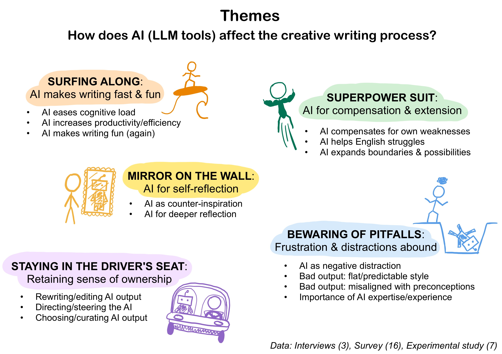

    
<h2 align="center">Exploring Human-AI Co-creative Writing</h3>
  

    <em> Master's Thesis - MSc Cognitive Science at Aarhus University - Spring 2023 </em>
   
  <a href="https://github.com/idabh"><strong>Ida Bang Hansen</strong></a>
   
  

### About The Project

This repository contains the code for all analysis and data visualisation from my research on using AI (LLM tools) in creative writing. This project was conducted as part of my master's thesis in cognitive science at Aarhus University, Spring 2023.

### Summary of master's thesis
Creativity is a complex and nuanced cognitive skill that can take many forms; from a toddler’s first experience with finger painting to a guitarist performing a solo on stage to a teenager writing poetry in a tattered notebook. Creative writing involves the creation of fictional narratives, and it is practised by many different people in various contexts. The creative writing process can be divided into different phases, each with its own associated goals and methods. The past decade has seen the development of new AI tools to support human writing in different ways, with the underlying technology based on generative large language models. This thesis investigates human-AI co-creative writing by exploring how writers use such AI tools. The research questions explore (i) uses for AI in the creative writing process, (ii) how AI affects the creative writing experience, and (iii) what, when and how writers integrate AI suggestions. Due to the complex and multidisciplinary nature of the topic of human-AI co-creative writing (cognitive science, psychology, human-computer interaction), this thesis employs a mixed-methods approach. Data triangulation was employed by collecting data from multiple sources to address the topic, including 3 in-depth interviews and 16 detailed survey responses from writers that use AI tools in their writing process, as well as an experimental pilot study with 7 writers without AI experience. In the exploratory study, participants wrote short stories with and without access to an LLM-based AI writing tool that could be prompted for text continuation suggestions. The sessions were screen and audio recorded, and surveys, interviews, and the think-aloud method were used to capture participants’ experiences. The analysis combined qualitative and quantitative methods, including thematic analysis, categorisation of AI output, logistic regression, analysis of writing styles and integrative leaps, and visualisation of user behaviour and survey results. Based on analysis, a schematic of identified AI uses in different creative writing phases was presented, representing a novel contribution of this thesis. The thematic analysis investigated how AI affects the creative writing process through themes capturing a) efficiency and enjoyment, b) compensation and extension of abilities, c) reflection and counter-inspiration, d) distraction and frustration, and e) three strategies for retaining sense of ownership, emphasising either the editing, steering, or curation of AI output. Additional analysis categorised AI output based on previous research and used logistic regression to predict participants’ choice of integrating AI output based on the categories, although no significant relation was found. Several findings from previous studies were replicated, including that most writers found the human-AI writing process enjoyable and experienced less cognitive load than when writing on their own. Most writers used AI in all writing phases and rated the AI tool highly on perceived ease of use and perceived usefulness, which has been linked to technology acceptance. Common negative experiences included dissatisfaction with AI output and getting distracted from writing goals. Most writers felt complete ownership over the created text, although with some exceptions. Generally, the results echoed previous research and also found large individual and contextual variation in writers’ experiences. Some of these contextual aspects were explored through analysis of writing styles and types of integrative leap participants performed to incorporate AI suggestions into their stories. Overall, this thesis work provides a framework of AI uses in creative writing for future research and presents findings that add to a growing body of research furthering our understanding of how co-creative writing tools can be used to empower writers in exercising creative cognition. The work illuminates several aspects of how AI affects the creative writing process and experience, including writers’ perceptions of the value and usefulness of the AI contributions, and of their sense of ownership over the created texts.

### Selected research findings

### Acknowledgments
* Header illustration created with Bing Image Creator

### Contact
idabanghansen@gmail.com
